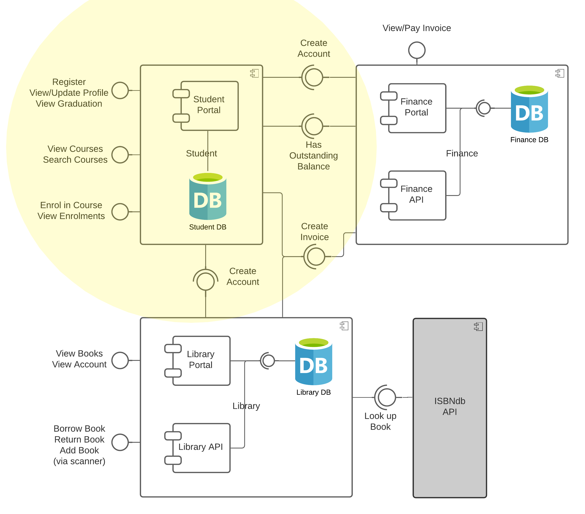

# Student Portal
This is a simple microservices-based application which exposes a RESTful API. It is written in Java using the Spring Boot framework. It is intended for use as part of the SESC module at Leeds Beckett University.

## Features
1. Register/Log in - create a portal user and log in.
2. View Courses - view all the courses offered.
3. Enrol in Course - enrol in course. If this is your first enrolment, a student account is created at this point. 
4. View Enrolments - view all the courses you are enrolled in.
5. View/Update Student Profile - view profile (includes student ID), update name and surname.
6. Graduation - view eligibility to graduate (must not have any outstanding invoices).

## Integrations
### 1. Database
The application integrates with a MariaDB relational database. 
Scripts to create the database schema can be found in the migrations folder and are run automatically by docker-compose.

### 2. Finance
The application integrates with the [Finance microservice](https://github.com/tvergilio/finance) via REST.
   1. When a student is created, a request is sent to the Finance microservice to create an account.
   2. When you enrol in a course, a request is sent to the Finance microservice to create an invoice.
   3. Upon checking the eligibility to graduate, a request is sent to the Finance microservice to see if there are any outstanding invoices.

### 3. Library
The application integrates with the [Library microservice](https://github.com/AidanCurley/CESBooks) via REST.
   1. When a student is created, a request is sent to the Library microservice to create an account.
   2. When a book is returned late, a fine is issued. A request is sent to the Finance microservice to create an invoice.

## Demos
### Assignment Requirements and Demo

## Run using Docker Compose
1. Ensure the finance and library microservices are running, or the integrations will not work. **Finance must be started first.** 
2. Edit any credentials in the `.env` file as needed (do not rename the DB_NAME). 
3. From the `student` directory, run the app and db services: 
   `docker-compose up`

## Contributing
Pull requests are welcome. For major changes, please open an issue first to discuss what you would like to change.
Please make sure to update tests as appropriate.

## License
Copyright (c) 2021 Thalita Vergilio

Permission is hereby granted, free of charge, to any person obtaining a copy
of this software and associated documentation files (the "Software"), to deal
in the Software without restriction, including without limitation the rights
to use, copy, modify, merge, publish, distribute, sublicense, and/or sell
copies of the Software, and to permit persons to whom the Software is
furnished to do so, subject to the following conditions:

The above copyright notice and this permission notice shall be included in all
copies or substantial portions of the Software.

THE SOFTWARE IS PROVIDED "AS IS", WITHOUT WARRANTY OF ANY KIND, EXPRESS OR
IMPLIED, INCLUDING BUT NOT LIMITED TO THE WARRANTIES OF MERCHANTABILITY,
FITNESS FOR A PARTICULAR PURPOSE AND NONINFRINGEMENT. IN NO EVENT SHALL THE
AUTHORS OR COPYRIGHT HOLDERS BE LIABLE FOR ANY CLAIM, DAMAGES OR OTHER
LIABILITY, WHETHER IN AN ACTION OF CONTRACT, TORT OR OTHERWISE, ARISING FROM,
OUT OF OR IN CONNECTION WITH THE SOFTWARE OR THE USE OR OTHER DEALINGS IN THE
SOFTWARE.